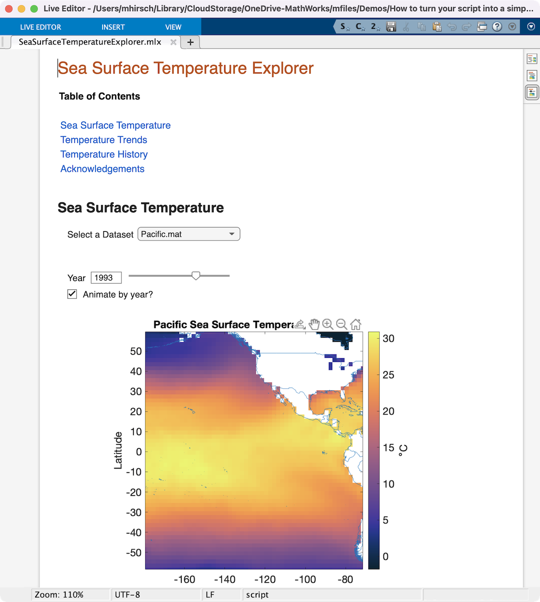

# How to Turn Your Script into a Simple App

## Overview
Custom-built apps are a great way to teach a concept, to automate common tasks, or to provide dashboards for interactively exploring complex data sets. And now with interactive controls in the Live Editor, if you can write a script, you can write an app. This talk demonstrates how to convert MATLAB scripts into simple notebook-style apps.

This demonstration covers the following concepts:
* Replacing literal values with interactive controls in Live Scripts
* Linking interactive controls in Live Scripts to values in the code 
* Live Editor automatically creates animations when a plot is updated in a loop
* Using custom graphics callbacks (ButtonDownFcn) within the Live Editor

This demonstration was built and tested with R2022a. It will likely mostly run in R2021a and R2021b, except for the custom ButtonDownFcn.

## Instructions
* Open the project, ScriptToApp.prj. This will set up your paths

Fun things to play with:
* SeaSurfaceTemperatureExplorer.mlx - This is the Live Script we build in the seminar
* SearSurfaceTemperatureAnimation.mlx - See how animation works in the Live Editor
* App Designer App\SeaSurfaceTemperatureExplorerAppDesigner.mlapp - The App Designer version of the app. Manually add the folder "Modified CDT Files" for this to work.
* helpers\trendmap.m, helpers\pickpoint.m: See how we set the custom ButtonDownFcn.

Copyright 2022 The MathWorks, Inc.
